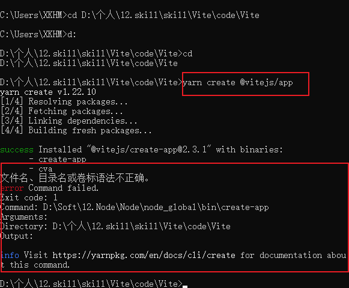

## Vite

### 第1节：开始

>更新换代，精进。

- 1.文档阅读。

>Vite中文官方文档地址（https://cn.vitejs.dev/）。

- 2.Vite介绍中有一句话叫做，下一代前端开发与构建工具，说明Vite这东西是面向未来的。

- 3.从Vite官方文档开始。

- 4.Vite跟rollup有联系。

>rollup官方文档地址：https://www.rollupjs.com(中文)

>https://rollupjs.org/guide/en（英文）

- 5.Vite是在做一件什么事情？

>Vite是在做一件让前端开发和工程化方面变简单的一件事情。

>将复杂的事情变为简单的事情，本身就是一件非常有意义的事情。

- 6.Vite启动速度优于webpack等打包工具的核心原因是什么？

>是因为Vite利用了JS的原生的模块化系统吗？还是其他的原因，或者说webpack这些打包工具慢具体是慢在什么地方呢？需要探寻和思考。估计是涉及到Vite和webpack相关原理性的东西。

- 7.Vite中有东西是基于[esbuild](https://esbuild.github.io/)的，而esbuild是基于go语言编写的，性能和速度上有优势。

- 8.动态模块热重载（HMR）。

- 9.Vite与[Snowpack](https://www.snowpack.dev/)比较。

- 10.Vite支持monorepo。

- 11.Vite第一优先级支持Vue。

>也就是说如果你的新项目用的是Vue，那么请将webpack换成Vite。

- 12.Vite(法语的意思是“快速的”)。

- 13.Vite由2部分组成。

>1.一个开发服务器。

>2.一套构建指令。(个人理解类似于npm的那套指令，例如：npm run serve这种)。

- 14.Vite使用条件：需要支持[原生ES模块动态导入](https://caniuse.com/es6-module-dynamic-import)的浏览器。

- 15.Vite需要的node.js版本需要 >= 12.0.0。

> Vite github地址：https://github.com/vitejs/vite。

- 16.yarn和npm的区别？

>参考文章：https://zhuanlan.zhihu.com/p/27449990

>yarn：JS包管理工具，为了弥补npm的一些缺陷而出现。

>yarn的优点：速度块，更加简洁的输出，多注册来源处理，更好的语义化。

>最重要的优点还是第一个和第二个，速度快是最重要的。

>yarn和npm的命令对比：

>npm install => yarn。

>npm install taco --save => yarn add taco。

>npm uninstall taco --save => yarn remove taco。

>npm install taco --save-dev => yarn add taco --dev。

>npm update --save => yarn upgrade。

>简单即合理思想。

>从大方面上来看，yarn还是优于npm的，尽管现在已经1202年了。

- 17.选yarn。

- 18.执行 yarn create @vitejs/app 遇到问题。

>问题原因，yarn的目录设置有问题，解决[参考文档：](https://juejin.cn/post/6844904111570190349)。

>解决问题命令

>先要创建这两个文件夹：D:\person\yarn\global，D:\person\yarn\cache。

```code
yarn config set global-folder "D:\person\yarn\global"。

yarn config set cache-folder "D:\person\yarn\cache"。

```

- 19.yarn crate @vitejs/app 其实是让你选择一个模板创建工程。

>@vitejs/create-app 模板[git地址： ](https://github.com/vitejs/vite/tree/main/packages/create-app)。

- 20.yarn也会安装node_modules，只是是并行安装，速度快于npm。

- 21.Vite可以指定目录作为根目录启动开发服务器。

- 22.安装好Vite下的默认命令含义。

```json

{
  "scripts": {
    "dev": "vite", // 启动开发服务器
    "build": "vite build", // 为生产环境构建产物
    "serve": "vite preview" // 本地预览生产构建产物
  }
}

```

- 23.npx是什么？

>npx是npm新增的一个模块，可以用于临时安装某个东西，可以避免全局安装。防止带来全局污染。

>npx本质上是一个npm的包执行器。

- 24.可以使用最新版本的Vite，只需要将github上的Vite最新代码克隆下来，然后用yarn link链接上就行了，官方提供了[方法：](https://cn.vitejs.dev/guide/#command-line-interface)。

### 第2节：功能

>探索。

- 总结：Vite由什么组成？

>Vite由2部分组成：一个开发服务器，一套构建指令。
