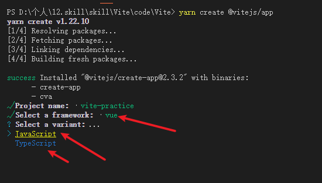

## 第5节：静态资源处理

>耐心。

## 第6节：构建生产版本

>进。

- 1.Vite支持chrome从63版本开始支持，不支持IE11。

>不在上面的浏览器可以通过 @vitejs/plugin-legacy 插件支持。

## 第7节：部署静态站点

>理解。

- 1.可以通过 --port 参数来配置服务的运行端口。

```json

{
  "scripts": {
    "preview": "vite preview --port 8080"
  }
}

```

- 2.CI CD是什么？

>是一套环境测试部署的流程工具链。

>避免了麻烦的手动部署，类似于jenkins这样一套工具。

## 第8节：环境变量和模式

>学习实践。

- 1.import.meta.env这种的使用动态的key值是无效的。

## 第9节：服务端渲染

>前行。

## 第10节：后端集成

>时间。

## 第11节：比较

>未来。

- 1.Vite支持monorepo。

## 第12节：从v1迁移

>理解。

## 插件API

>耐心。

- 1.实践。

## 实践

>实践是检验真理的唯一标准。

- 1.如何搭建1个Vite项目？

>找到对应文件夹执行相关命令，这里我是使用yarn的。

```sh

yarn create @vitejs/app

```

>然后可以选择对应的模板。


>选择完模板之后，还可以选择对应的开发语言，例如：JavaScript还是TypeScript。



>此时已经创建完成，我模板选的是Vue模板，然后语言选的是JS。


>此时（20210526）默认带的Vue版本是3.0.5。


>简单创建一个Vite项目的步骤就已经完成了。

- 2.如何将一个已有项目转换成使用Vite的？

>1.首先这个项目原来是使用glup进行打包的工程，然后每次用 yarn run zip 执行打包命令的时间在4s到5s之间，不低于4秒，不超过5秒，平均时间大概在4.5秒。

>2.对整个工程的文件夹进行梳理，没用的东西就删掉。

- 总结：学习需要的是什么？

>学习需要的是耐心和坚持。
